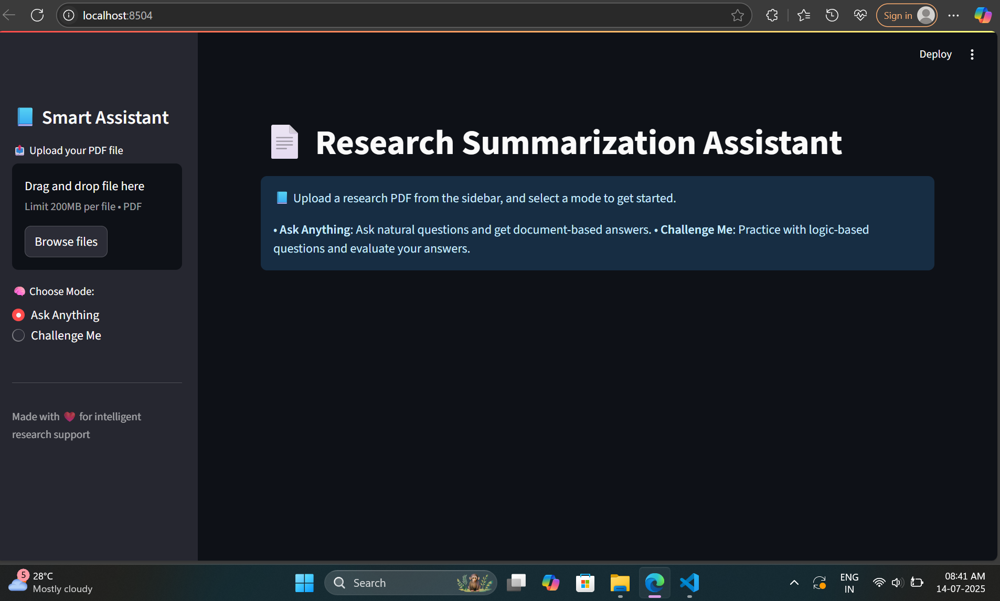

# 🤖 Smart Research Assistant

An AI-powered Streamlit app to **summarize**, **question**, and **evaluate your understanding** of research papers.
Just upload a PDF — and let the assistant do the thinking.

> 🔍 Ideal for students, researchers, and curious minds who want to interact with academic content.

---

## ✨ Features

- 📄 **PDF Upload & Parsing**
  Upload any research paper in `.pdf` format. The app extracts clean, readable text automatically.

- ✂️ **Smart Summarization**
  View a concise summary of the full document powered by transformer-based models.

- 💬 **Ask Anything Mode**
  Ask natural language questions about the paper and get accurate, context-aware answers with justification.

- 🧠 **Challenge Me Mode**
  Test your understanding of the paper with AI-generated logic-based questions — every session is unique!

- ✅ **Answer Evaluation**
  Your answers are automatically compared and evaluated:
  - ✅ Correct
  - 🟡 Almost Correct
  - ❌ Incorrect (with correct answer shown)

- 🔁 **Randomized Question Generator**
  Generates a fresh challenge each time from different parts of the paper.

- 👓 **Justification Engine**
  Every answer is accompanied by supporting logic pulled from the document.

- 🎨 **Custom Logo & Clean UI**
  Includes a custom assistant logo placed at the top-left for branding.

---

## 🧠 Architecture Overview

PDF Upload
↓
Text Extraction (PyPDF2)
↓
Summarizer (Transformers)
↓
┌────────────────────────┬────────────────────────────┐
│ Ask Anything │ Challenge Me │
│ (Question → Answer) │ (Gen Q → User A → Eval) │
└────────────────────────┴────────────────────────────┘

---

## 🚀 Setup Instructions

### 1. Clone the Repository

```bash
git clone https://github.com/Nidhiisinhaa/smart-research-assistant.git
cd smart-research-assistant

2. Install Dependencies
pip install -r requirements.txt

3. Run the App
streamlit run app.py

App will open at http://localhost:8501

## 🖼️ Screenshot

> Here’s a quick look at the Smart Assistant in action:



